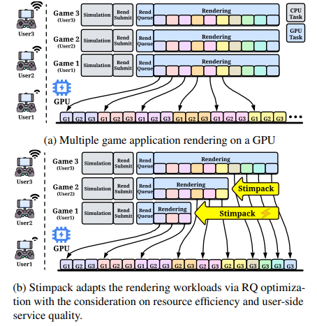
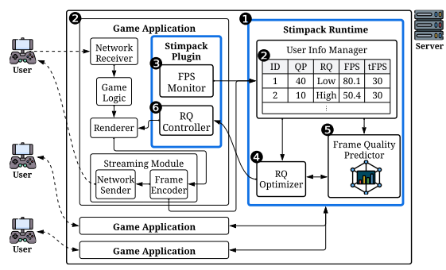

# Stimpack: An Adaptive Rendering Optimization System for Scalable Cloud Gaming

[](https://opensource.org/licenses/MIT)
[](https://arxiv.org/pdf/2412.19446.pdf)
[](https://doi.org/10.xxxx/xxxx)
[](https://www.python.org/downloads/release/python-3100/)
[](https://github.com/astral-sh/uv)
[](https://www.linux.org/)


Stimpack is the open-source implementation of the research paper **"Stimpack: An Adaptive Rendering Optimization System for Scalable Cloud Gaming"**.

In cloud gaming, high-quality rendering often yields diminishing returns on user-perceived quality when delivered over bandwidth-constrained or lossy networks. Stimpack solves this by adaptively balancing server-side rendering costs against user-perceived quality, maximizing system utility in multi-user scenarios.

<p align="center">
  
  &nbsp;&nbsp;&nbsp;&nbsp; 
</p>
<p align="center">
  <em><b>Figure 1:</b> Strategic adaptation for multi-user scalability (Left) and the Stimpack System Architecture (Right).</em>
</p>

### Why Stimpack?
Cloud gaming GPUs are often shared among multiple users. Traditional systems waste resources by rendering at high quality even when the network is poor, leading to GPU bottlenecks and high latency.

**Stimpack maximizes efficiency by:**
- **Workload Adaptation**: Instead of blindly rendering at high quality, Stimpack dynamically scales down the Rendering Quality (RQ) for users under poor network conditions.
- **Utility Maximization**: By reducing unnecessary rendering load that would be lost anyway during network compression, we free up GPU resources to maintain a playable FPS for all concurrent users and accommodate twice the capacity of baseline systems.
- **Evaluated on Network Traces and Unreal Engine-powered Games**: We validate our approach using real-world 3G/4G network traces and Unreal Engine-based games.

---

### Visual Results (Demo)
The following demos show a side-by-side comparison in a multi-user scenario. **Stimpack (Left)** adaptively optimizes rendering quality, balancing performance and computational load.

<p align="center">
  
  &nbsp;&nbsp;
  
</p>
<p align="center">
  <em><b>Side-by-Side:</b> Stimpack (Left) vs. Non-Stimpack Baseline (Right).</em>
</p>

---

## Core Components

The project is structured into three primary modules:

#### 1. `runtime/` - System Implementation
The core execution engine of Stimpack. It manages the real-time feedback loop between the game engine and the network conditions.

##### Multi-threaded Architecture (via `runner.py`):
- **`User_Registerer`**: Listens for new game sessions, negotiates ZeroMQ (ZMQ) IPC ports, and initializes user state.
- **`User_QP_Updater`**: A router-based server that receives and updates network-induced compression (QP) levels.
- **`RQ_Manager`**: The central controller that periodically adjusts rendering quality based on FPS and predicted VMAF.
- **`FL_Monitor`**: (Spawned per user) Monitors real-time frame latency to ensure SLO compliance.

##### Network Simulation & Replay
- **`replay_user_qp.py`**: Simulates dynamic network conditions by replaying pre-recorded QP traces from CSV files to the runtime.
- **`update_user_qp.py`**: A client tool used to inject QP updates into the `User_QP_Updater`.

#### 2. `models/` - Quality Assessment & Prediction
Contains the pipeline for quantifying user-perceived quality.
- **VMAF Calculation**: Scripts to automate VMAF scoring using `easyvmaf` Docker containers across various scenes and configurations.
- **ML Training**: Implementations of various regressors (Decision Tree, Random Forest, SVR, etc.) to predict VMAF from (Codec, RQ, QP) features.
- **Dataset**: Pre-processed training/testing data and pre-trained models.

#### 3. `net_data/` - Network Traces & Profiling
Tools and data for simulating and analyzing network environments.
- **Traces**: Real-world 3G and 4G network logs.
- **Processing**: Scripts to convert raw network logs into structured CSVs, calculate moving averages of throughput (kbps), and generate QP traces corresponding to the network traces.

---

## Installation & Usage

Stimpack requires Python 3.10+ and uses **uv** for efficient dependency management.

```bash
# Clone the repository
git clone https://github.com/jin-heo/Stimpack.git
cd Stimpack

# Install dependencies using uv
uv sync
```

#### 1. Running the Stimpack Runtime
Start the main quality manager to listen for users and manage rendering:

```bash
uv run runtime/runner.py [log_file] [case_name]
```

#### 2. Simulating Network Dynamics (QP Replay)
In a separate terminal, replay a network trace to simulate changing network quality for a specific user:

```bash
uv run runtime/replay_user_qp.py <user_id> <path_to_trace.csv>
```

#### 3. Training VMAF Models
To retrain the quality prediction models:

```bash
cd models/pred_vmaf
uv run 0_model_train_rev.py
```

---

## Citation
```bibtex
@inproceedings{heo2026stimpack,
  title={Stimpack: An Adaptive Rendering Optimization System for Scalable Cloud Gaming},
  author={Heo, Jin and Wang, Vic and Bhardwaj, Ketan and Gavrilovska, Ada},
  booktitle={23rd USENIX Symposium on Networked Systems Design and Implementation (NSDI 26)},
  year={2026}
}
```

## License
Licensed under the [MIT License](LICENSE).

---

## 🕹️ Fun Fact: Why the name "Stimpack"?

The name **Stimpack** is a tribute to the iconic ability of the **Terran Marine** in Blizzard's *StarCraft* series.

In the game, a Marine injects a Stimpack to trade a bit of health for a massive boost in combat speed and efficiency.
Similarly, our system strategically adjusts (or "sacrifices") unnecessary rendering details to significantly boost the overall **scalability and utility** of the cloud gaming server.

As a former competitive *StarCraft* player, the lead author designed Stimpack with a "gamer-first" mindset: ensuring that every bit of computing power is spent where it actually improves the experience.

<p align="center">
  
</p>
